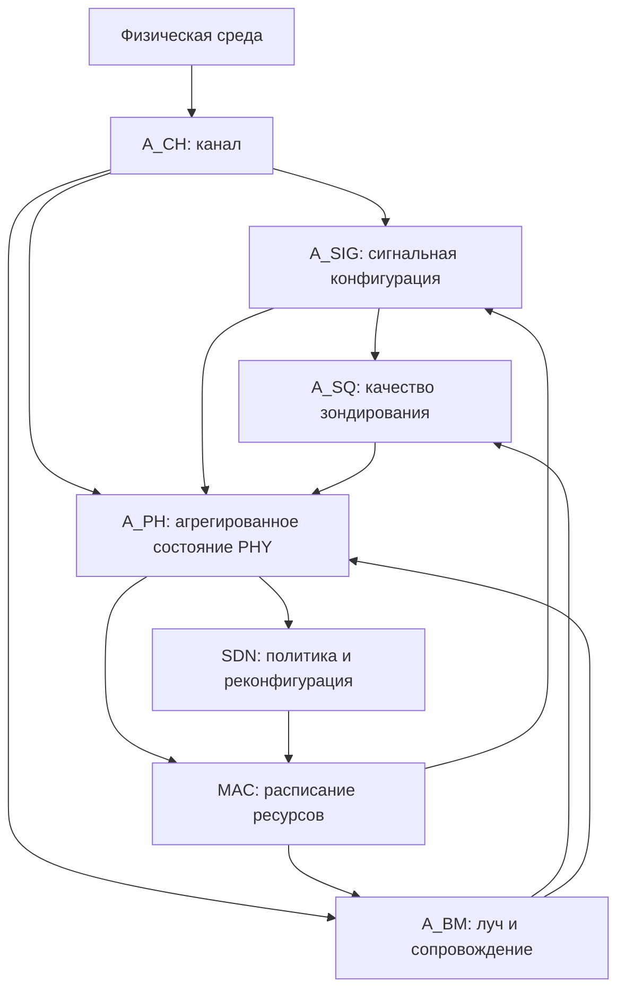
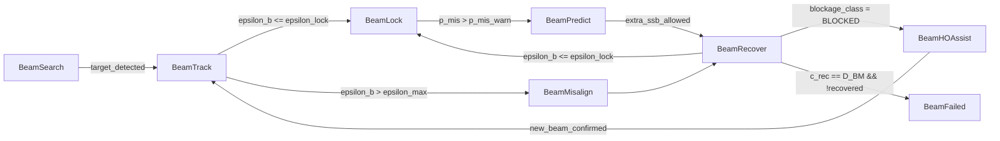

# Формализация PHY-уровня в иерархической SDN-управляемой 6G ISAC-сети

## Аннотация

В разделе формализуется физический уровень PHY (Physical Layer, физический уровень) для иерархической модели SDN-управляемой сети 6G ISAC, где SDN (Software-Defined Networking, программно-конфигурируемая сеть) используется для оркестрации ресурсов, а ISAC (Integrated Sensing and Communication, интегрированные связь и зондирование) объединяет передачу данных и радиозондирование среды. Предлагаемая модель не является радиофизическим симулятором; ИИ (искусственный интеллект) в ней не применяется. PHY-уровень описывается как композиция аппроксимированных контрактных временных автоматов, где непрерывные физические зависимости заменяются конечными классами, порогами и контрактами вида «допущение-гарантия». Такой подход сохраняет проверяемую связь между параметрами сигнала, состоянием канала, качеством зондирования и решениями MAC/SDN-уровней.

## 1. Назначение модели

Физический уровень в 6G ISAC-сети выполняет две связанные функции: обеспечивает передачу данных и формирует информацию о физической среде. В отличие от детального моделирования формы сигнала на уровне I/Q-отсчетов (in-phase/quadrature, синфазная и квадратурная компоненты), в данной работе используется аппроксимированная автоматная модель. Ее задача состоит в том, чтобы передавать вышестоящим уровням конечный набор KPI (Key Performance Indicators, ключевые показатели качества) и событий деградации.

PHY-уровень не выбирает глобальную политику управления ресурсами. Выбор режима выполняется на уровнях MAC (Medium Access Control, управление доступом к среде) и SDN. PHY применяет полученные конфигурации, оценивает их последствия и формирует отчеты для контроллера. Такой принцип соответствует сетевому фокусу работы: предметом анализа являются не новые радиосигналы, а верифицируемое поведение SDN-управляемой ISAC-сети.

В качестве литературной основы используются работы по сигнализации ISAC, метрикам SensCAP, кооперативному зондированию, beam management (управление лучом), UAV-ISAC (Unmanned Aerial Vehicle ISAC, ISAC-системы с беспилотными летательными аппаратами), RIS (Reconfigurable Intelligent Surface, реконфигурируемая интеллектуальная поверхность), freshness/AoI (Age of Information, давность информации), формальной проверке временных автоматов и семантике UPPAAL [1]-[13]. Отдельно учитывается работа Huang et al. по ISAC-enabled low-overhead beam management (ISAC-поддержанному управлению лучом с малыми накладными расходами), поскольку она задает связь между SSB (Synchronization Signal Block, блок синхронизационного сигнала), PRS (Positioning Reference Signal, позиционный опорный сигнал), вероятностью рассогласования луча и накладными расходами PHY [6]. Исходная расширенная аннотация (extended abstract) Mustafin--Tinishov не включена в список литературы, поскольку является формализуемым текстом, а не внешним источником.

## 2. Архитектурное положение PHY

Рассматриваемая сеть представляется как иерархия:

```text
Service/Application
       |
       v
SDN control plane
       |
       v
MAC/resource scheduling
       |
       v
PHY
       |
       v
Physical environment
```

Сервисный уровень задает SLA (Service-Level Agreement, соглашение об уровне обслуживания): задержку, пропускную способность, надежность доставки, минимальную вероятность обнаружения, допустимую вероятность ложной тревоги, точность зондирования и допустимую давность информации. SDN-контроллер выбирает глобальную политику: разбиение ресурсов между связью и зондированием, маршрутизацию, восстановление и реконфигурацию. MAC-уровень реализует расписание радиоресурсов: плотность пилотов, распределение символов полезной нагрузки, мощность, MCS (Modulation and Coding Scheme, схема модуляции и кодирования) и команды формирования луча.

PHY-уровень является нижним измерительно-оценочным слоем. Он наблюдает радиосреду, классифицирует состояние сигнала, оценивает качество связи и зондирования, а затем формирует события для MAC/SDN.

## 3. Аппроксимированные контрактные временные автоматы

Каждый компонент PHY задается как аппроксимированный контрактный временной автомат:

```math
\mathcal{A}_i =
(L_i,l_i^0,C_i,V_i,E_i,Inv_i,In_i,Out_i,Ass_i,Gar_i),
```

где `L_i` -- конечное множество состояний, `l_i^0` -- начальное состояние, `C_i` -- часы, `V_i` -- дискретные переменные, `E_i` -- переходы, `Inv_i` -- инварианты, `In_i` и `Out_i` -- входные и выходные события, `Ass_i` -- допущения контракта, `Gar_i` -- гарантии контракта.

Переход имеет вид:

```math
e=(l,g,a,r,u,l'),
```

где `g` -- guard (условие перехода), `a` -- событие синхронизации, `r` -- сброс часов, `u` -- обновление переменных, `l` и `l'` -- исходное и целевое состояния.

Аппроксимация означает, что непрерывные радиофизические зависимости не вычисляются с полной точностью, а отображаются в конечные классы:

```text
LOW, OK, HIGH, CRITICAL
```

или в конечные интервалы. Такой выбор необходим для проверки достижимости, отсутствия тупиков, соблюдения сроков и корректности реакции на деградацию.

### 3.1 Функция абстракции PHY

Непрерывные PHY-оценки не являются состояниями временного автомата. Они вычисляются внешним PHY-estimator (оценивателем физического уровня) или измерительным блоком, после чего отображаются в конечные классы:

```math
\alpha_{PHY}:X_{cont}\rightarrow X_{disc},
```

```math
\alpha_{PHY}(x_{PHY}) =
(ChannelClass,SignalClass,BeamClass,SensingClass,FreshnessClass).
```

Здесь `X_cont` -- пространство непрерывных и вероятностных оценок, а `X_disc` -- конечное пространство классов, используемых в автоматах. Временные автоматы не доказывают физическую истинность `Pd >= 0.95` или `p_mis <= 0.01`; они проверяют, что при входном классе `PdClass=LIMITED` или `BeamClass=MISALIGNED` система за ограниченное время переходит в нужное состояние и публикует нужное событие. Поэтому вероятности `Pd`, `Rfa`, `p_mis` и величины `SINR`, `BLER`, `CRB`, `Omega_BM` трактуются как входные оценки для дискретизации, а не как непрерывные переменные UPPAAL-модели.

Пример дискретизации:

```text
SINRClass =
  OUTAGE  if SINR_c < SINR_out
  LOW     if SINR_out <= SINR_c < SINR_min
  OK      if SINR_min <= SINR_c < SINR_high
  HIGH    otherwise
```

Пограничные и неопределенные случаи относятся к худшему допустимому классу. Это задает консервативную abstraction (абстракцию): safety-свойства проверяются жестче, чем в идеализированной радиофизической модели.

### 3.2 Конечные домены переменных

| Класс | Домен | Назначение |
|---|---|---|
| `SINRClass` | `OUTAGE`, `LOW`, `OK`, `HIGH` | состояние отношения сигнал-интерференция-шум |
| `BLERClass` | `OK`, `LIMITED`, `FAILED` | состояние блочной ошибки связи |
| `PdClass` | `OK`, `LIMITED`, `FAILED` | класс вероятности обнаружения |
| `RfaClass` | `OK`, `LIMITED`, `FAILED` | класс вероятности ложной тревоги |
| `AccClass` | `OK`, `LIMITED`, `FAILED` | класс точности оценки положения/скорости |
| `CapClass` | `OK`, `LIMITED`, `FAILED` | класс sensing capacity (емкости зондирования) |
| `BeamClass` | `SEARCH`, `TRACK`, `LOCKED`, `WARN`, `MISALIGNED`, `FAILED` | состояние луча |
| `AoSClass` | `FRESH`, `STALE`, `EXPIRED` | давность sensing-информации |
| `OverheadClass` | `LOW`, `NORMAL`, `HIGH`, `CRITICAL` | накладные расходы PHY/beam management |
| `PHYClass` | `NORMAL`, `COMM_DEGRADED`, `SENSING_DEGRADED`, `JOINT_DEGRADED`, `RECOVERY`, `FAILURE` | агрегированное состояние PHY |

### 3.3 Операционная семантика

Для реализации в UPPAAL-подобной модели используется следующий набор часов:

```text
c_meas    -- время с последнего измерения канала
c_sig     -- время с последней сигнальной реконфигурации
c_prs     -- время с последнего PRS-наблюдения
c_ssb     -- время с последнего SSB-блока
c_sense   -- время с последней оценки sensing KPI
c_report  -- время с последнего PHY-отчета
c_rec     -- время с начала восстановления
aos_bs    -- локальная давность sensing-информации
aos_ctrl  -- давность sensing-информации у SDN-контроллера
```

Сбросы часов задаются явно:

```text
c_meas   := 0 on measurement_update?
c_sig    := 0 on signal_config_applied?
c_prs    := 0 on prs_observation?
c_ssb    := 0 on ssb_burst_seen?
c_sense  := 0 on sensing_update?
c_report := 0 on phy_kpi_report!
c_rec    := 0 on recovery_start?
aos_bs   := 0 on successful_sensing?
aos_ctrl := 0 on controller_report_delivery?
```

Синхронизация автоматов задается каналами. Такой стиль явного задания событий, сроков и состояний соответствует практике формального моделирования сетевых протоколов и встроенных коммуникационных механизмов [12]:

```text
channel_report!        -> channel_report?
signal_report!         -> signal_report?
beam_report!           -> beam_report?
sensing_report!        -> sensing_report?
phy_kpi_report!        -> mac_phy_kpi? / sdn_phy_kpi?
beam_misaligned!       -> beam_misaligned?
recovery_start!        -> recovery_start?
recovery_done!         -> recovery_done?
```

Переход автомата считается допустимым, если выполнен guard, соблюден invariant исходного состояния, выполнена синхронизация и применены resets/updates. Например:

```text
BeamRecover -> BeamFailed
guard:  c_rec == D_BM && !recovered
sync:   beam_failure!
reset:  c_report := 0
update: BeamClass := FAILED
```

### 3.4 Корректность абстракции

Модель является sound (корректной) только относительно выбранной функции `alpha_PHY`. Если абстракция консервативна, то выполнение safety-свойства на дискретной модели означает отсутствие соответствующего нарушения для всех непрерывных состояний, попавших в эти классы. Контрпример, найденный model checker (средством проверки моделей), может быть либо физически реализуемым сценарием, либо артефактом слишком грубой дискретизации; поэтому контрпримеры требуют обратной проверки на уровне PHY-estimator. Пороговые значения `SINR_min`, `Pd_min`, `p_mis_max`, `Omega_BM_max` не являются универсальными константами и задаются сценарием, SLA или профилем эксперимента.

## 4. Композиция автоматов PHY

PHY-уровень задается композицией:

```math
\mathcal{A}_{PHY}
=
\mathcal{A}_{CH}
\parallel
\mathcal{A}_{SIG}
\parallel
\mathcal{A}_{BM}
\parallel
\mathcal{A}_{SQ}
\parallel
\mathcal{A}_{PH}.
```

Здесь `A_CH` -- автомат состояния канала, `A_SIG` -- автомат сигнальной конфигурации, `A_BM` -- автомат формирования и сопровождения луча, `A_SQ` -- автомат качества зондирования, `A_PH` -- агрегирующий автомат PHY.



`A_PH` получает не только результат `A_SQ`, но и отдельные отчеты `channel_report`, `signal_report`, `beam_report` и `sensing_report`. Это необходимо, поскольку агрегированное состояние PHY различает деградацию связи, деградацию зондирования и совместную деградацию.

Сигнальные технологии OFDM (Orthogonal Frequency-Division Multiplexing, ортогональное частотное мультиплексирование), OTFS (Orthogonal Time Frequency Space, ортогональное представление во временно-частотном пространстве) и AFDM (Affine Frequency-Division Multiplexing, аффинное частотное мультиплексирование) не задаются отдельными состояниями PHY. Они являются значениями дискретной переменной `W` в автомате `A_SIG`. Состояния `A_SIG` описывают не тип waveform (форма сигнала), а режим использования сигнала: pilot-based sensing (зондирование по пилотам), payload-assisted sensing (зондирование с использованием полезной нагрузки), reconfiguration (реконфигурация) и degraded signal mode (деградированный сигнальный режим).

## 5. Контракты автоматов

| Автомат | Допущения контракта | Гарантии контракта |
|---|---|---|
| `A_CH` | Измерения мощности, интерференции и задержки поступают с периодом не больше `T_meas`. | Формируется класс канала и событие деградации при нарушении порогов. |
| `A_SIG` | MAC/SDN задают допустимые значения `W`, `rho_p`, `MCS` и режима зондирования. | Возвращается класс качества сигнальной конфигурации и признак нарушения DRT. |
| `A_BM` | Команды луча, SSB/PRS-конфигурации и ограничения по мощности имеют допустимые конечные классы. | Возвращаются класс ошибки сопровождения, вероятность рассогласования, класс накладных расходов и событие восстановления или handover assistance (помощь передаче обслуживания). |
| `A_SQ` | На вход поступают классы канала, сигнала и луча. | Формируются `Pd`, `Rfa`, accuracy class, freshness class и SensCAP class. |
| `A_PH` | Все дочерние автоматы публикуют KPI за конечное время. | Формируется агрегированное состояние PHY и отчет для MAC/SDN. |

Семантика контракта задается как:

```math
\mathcal{A}_i\models Ass_i \Rightarrow Gar_i.
```

Композиция корректна только при замыкании гарантий нижних автоматов на допущения верхних:

```text
Gar_CH  => Ass_SIG
Gar_CH  => Ass_BM
Gar_CH  => Ass_SQ
Gar_SIG => Ass_SQ
Gar_BM  => Ass_SQ
Gar_CH  => Ass_PH
Gar_SIG => Ass_PH
Gar_BM  => Ass_PH
Gar_SQ  => Ass_PH
```

Например, `Gar_CH` означает, что `ChannelClass` публикуется не реже чем раз в `T_meas`; тогда `Ass_SQ` может требовать, что свежий `ChannelClass` доступен при вычислении `SensingClass`. При нарушении assumption соответствующий автомат переходит не в штатное состояние, а в ограниченное или отказное состояние, например `SensingFailure` или `PHYFailure`.

## 6. Параметры и KPI

Вектор параметров PHY имеет вид:

```math
\begin{aligned}
x_{PHY} = (&P_t,P_r,N_0,I,L_p,\sigma_\tau,f_D,
B,f_c,\Delta f,S_c,I_c,S_s,N_s,\\
&MCS,\rho_p,W,\kappa_{DRT},
\psi_{cs},\psi_{ps},\\
&\theta_b,G_b,\epsilon_b,n_B,
\tau_{SSB},T_{SSB},T_{PRS},\\
&N_{RE}^{PRS},\delta_{PRS},S_t,S_f,
p_{mis},\Omega_{BM},\\
&T_s,\gamma_{det},A_{cov}).
\end{aligned}
```

Здесь `P_t` и `P_r` -- мощности передачи и приема, `N_0` -- спектральная плотность шума, `I` -- суммарная интерференция, `L_p` -- потери распространения, `sigma_tau` -- задержочный разброс, `f_D` -- доплеровский разброс, `B` -- полоса, `f_c` -- несущая частота, `Delta f` -- разнос поднесущих, `S_c` -- полезная мощность коммуникационного сигнала, `I_c` -- интерференция в коммуникационном тракте, `S_s` -- полезная мощность sensing-сигнала, `N_s` -- шум sensing-приемника, `rho_p` -- плотность пилотов, `kappa_DRT` -- класс DRT (Deterministic-Random Trade-off, компромисс между детерминированностью зондирования и случайностью данных), `psi_cs` -- класс constellation shaping (формирование созвездия), `psi_ps` -- класс pulse shaping (импульсное формирование), `theta_b` -- направление луча, `G_b` -- усиление луча, `epsilon_b` -- ошибка сопровождения, `n_B` -- число дискретных лучей, `tau_SSB` -- период SSB-блоков, `T_SSB` -- длительность SSB-блока, `T_PRS` -- длительность PRS-блока, `N_RE^PRS` -- число PRS resource elements (ресурсных элементов PRS), `delta_PRS` -- доля PRS-ресурсов во временной области, `S_t` и `S_f` -- разрежение PRS по времени и частоте, `p_mis` -- вероятность рассогласования луча, `Omega_BM` -- доля накладных расходов beam management, `T_s` -- длительность зондирующего сигнала, `gamma_det` -- порог обнаружения, `A_cov` -- зона покрытия зондирования.

Для связи используется:

```math
SINR_c=\frac{S_c}{I_c+N_0B},
```

где `SINR_c` -- signal-to-interference-plus-noise ratio (отношение сигнал-интерференция-шум) для связи. На его основе задаются `BER` (Bit Error Rate, вероятность битовой ошибки), `BLER` (Block Error Rate, вероятность ошибки блока) и `CQI` (Channel Quality Indicator, индикатор качества канала).

Для зондирования используется отдельная величина:

```math
SINR_s=
\frac{S_s}
{I_{c\to s}+I_{self}+I_{mutual}+N_s},
```

где `I_{c->s}` -- интерференция от коммуникационных сигналов в тракте зондирования, `I_self` -- собственная интерференция, `I_mutual` -- взаимная интерференция между узлами зондирования, `N_s` -- шум зондирующего приемника.

## 7. SensCAP и качество зондирования

SensCAP (Sensing Capability, способность зондирования) трактуется как системная метрика, состоящая из sensing probability (вероятность обнаружения при заданной ложной тревоге), sensing accuracy (точность оценки положения и скорости) и sensing capacity (число целей на единицу площади при заданных требованиях качества) [2], [3].

Sensing probability задается как:

```math
Pd(R_{fa})=\frac{N_{det}}{N},
\qquad
R_{fa}\le R_{fa}^{max},
```

где `Pd` -- вероятность обнаружения, `Rfa` -- false alarm rate (вероятность ложной тревоги), `N_det` -- число успешно обнаруженных целей, `N` -- общее число целей.

Для CFAR (Constant False Alarm Rate, обнаружение при постоянной вероятности ложной тревоги) порог может быть представлен в аппроксимированной форме:

```math
S_{thres}
=
N_{ru}
\left((R_{fa})^{-1/N_{ru}}-1\right)p_n,
```

где `N_ru` -- число reference cells (опорных ячеек) для оценки шума, `p_n` -- оцененная мощность шума.

Точность зондирования задается через localization accuracy (точность локализации) и velocity accuracy (точность скорости):

```math
\Pr(\Delta r\le l_a)\ge q,
\qquad
\Pr(\Delta v\le v_a)\ge q_v.
```

CRB (Cramer-Rao Bound, граница Крамера--Рао) сохраняется как теоретическая нижняя граница ошибки:

```math
\mathbf{CRB}=(CRB_R,CRB_v,CRB_\theta).
```

Sensing capacity задается как:

```math
C_s(Q_s,T_0)=\frac{N^*(Q_s,T_0)}{A},
```

где `A` -- площадь зоны зондирования, `T_0` -- окно оценки, `Q_s=(l_a,v_a,Pd_min,Rfa_max,q,q_v)` -- требуемое качество зондирования, `N^*(Q_s,T_0)` -- максимальное число целей в окне `T_0`, для которого выполняются требования:

```math
\begin{aligned}
Pd(R_{fa}^{max}) &\ge Pd_{min},\\
\Pr(\Delta r\le l_a) &\ge q,\\
\Pr(\Delta v\le v_a) &\ge q_v.
\end{aligned}
```

Доля ресурсов зондирования:

```math
u_s=\frac{T_s}{T_0},\qquad 0<u_s\le 1.
```

В автоматной модели `C_s` и `u_s` не используются как непрерывные переменные guards (условий переходов). Они отображаются в `CapClass` и `OverheadClass`, например `OK`, `LIMITED`, `FAILED`. Это позволяет выразить SensCAP без перехода к вероятностному симулятору.

## 8. Состояния автоматов

### 8.1 Автомат канала `A_CH`

| Состояние | Условие входа | Выход |
|---|---|---|
| `ChannelNominal` | `SINR_c >= SINR_min`, нет критической интерференции | `channel_ok!` |
| `InterferenceLimited` | `I > I_max` | `channel_degraded!` |
| `MobilityLimited` | `f_D > f_D_max` | `mobility_alert!` |
| `MultipathLimited` | `sigma_tau > sigma_tau_max` | `multipath_alert!` |
| `Blockage` | `P_r < P_min` | `blockage_detected!` |
| `Outage` | `SINR_c < SINR_out` | `phy_outage!` |

При одновременном выполнении нескольких условий используется приоритет:

```text
Outage
> Blockage
> InterferenceLimited
> MobilityLimited
> MultipathLimited
> ChannelNominal
```

В проверяемой модели guards должны применяться к конечным классам, например `SINRClass=OUTAGE`, `ChannelClass=BLOCKED`, `InterferenceClass=HIGH`. Пороговые выражения в таблице задают инженерную интерпретацию этих классов.

### 8.2 Автомат сигнальной конфигурации `A_SIG`

```math
W\in\{OFDM,OTFS,AFDM,SC,OTHER\}.
```

| Состояние | Смысл | Типичный переход |
|---|---|---|
| `SignalNominal` | Конфигурация выполняет ограничения связи и зондирования | при `rho_p >= rho_p_min` возможен переход к pilot-based режиму |
| `PilotBasedSensing` | Зондирование основано на пилотных и опорных сигналах | при недостатке пилотов и разрешении payload-режима |
| `PayloadAssistedSensing` | Используются отражения полезной нагрузки; учитываются DRT, созвездие и импульсная форма | при ухудшении DRT или `BLER > BLER_max` |
| `SignalReconfiguring` | MAC/SDN изменяет `W`, `rho_p`, `MCS` или shaping-классы | после применения конфигурации |
| `SignalLimited` | Конфигурация не удовлетворяет порогам | до команды реконфигурации |

### 8.3 Автомат луча `A_BM`

Автомат `A_BM` описывает beam management (управление лучом): начальный поиск направления, сопровождение мобильной цели, фиксацию узкого луча, прогноз выхода цели за границу луча, восстановление направления и помощь handover (передаче обслуживания между базовыми станциями). В отличие от непрерывной beamforming optimization (оптимизации вектора формирования луча), данный автомат не вычисляет оптимальный вектор антенн; он классифицирует наблюдаемые состояния и публикует события для MAC/SDN. Такая декомпозиция согласуется с работой Huang et al., где SSB используется для широкого поиска и обнаружения блокировки, а PRS -- для оценки скорости/дальности и упреждающего beam alignment (выравнивания луча) [6].

В UAV-ISAC сценариях beamforming (формирование луча) связан с траекторией и подвижностью узла [8], [9], а в наземных mmWave/6G-сценариях число лучей `n_B`, ширина луча и выигрыш `G_b` зависят от фазированных антенных решеток и RIS-элементов [10], [11]. В данной модели эти физические особенности не оптимизируются напрямую, а входят в классы `BeamClass`, `MisClass` и `OverheadClass`.

Автомат задается как:

```math
\mathcal{A}_{BM}=
(S_{BM},s_0,C_{BM},V_{BM},E_{BM},G_{BM},R_{BM},I_{BM}),
```

где `S_BM` -- конечное множество состояний луча, `s_0` -- начальное состояние, `C_BM={c_ssb,c_prs,c_rec}` -- часы SSB-периода, PRS-наблюдения и восстановления, `V_BM` -- дискретные переменные луча, `E_BM` -- входные и выходные события, `G_BM` -- guards (условия переходов), `R_BM` -- обновления переменных, `I_BM` -- инварианты (условия нахождения в состоянии).

Основные переменные автомата:

```text
beam_id        -- номер выбранного луча
n_B            -- число дискретных лучей
theta_b        -- текущее направление луча
theta_hat      -- оцененное направление цели
epsilon_b      -- ошибка сопровождения
p_mis          -- вероятность рассогласования луча
Omega_BM       -- доля накладных расходов beam management
blockage_class -- класс блокировки: NONE / WARN / BLOCKED
prs_class      -- качество PRS-оценки: OK / LIMITED / FAILED
```

| Состояние | Смысл | Типичный переход |
|---|---|---|
| `BeamSearch` | Широкий поиск направления по SSB или широкому лучу | при `target_detected` и `prs_class != FAILED` переход в `BeamTrack` |
| `BeamTrack` | PRS-оценка положения/скорости и сопровождение цели | при `epsilon_b <= epsilon_lock` переход в `BeamLock` |
| `BeamLock` | Узкий луч считается согласованным с целью | при `p_mis > p_mis_warn` или `boundary_crossing_predicted` переход в `BeamPredict` |
| `BeamPredict` | Прогнозируется выход цели за границу луча или ухудшение из-за блокировки | при разрешенной вставке extra SSB (дополнительного SSB) переход в `BeamRecover` |
| `BeamMisalign` | Ошибка сопровождения превышает допустимый порог | публикуется `beam_misaligned!`, затем переход в `BeamRecover` |
| `BeamRecover` | Выполняется восстановление направления через extra SSB/CSI-RS (Channel State Information Reference Signal, опорный сигнал состояния канала) | при успешной коррекции переход в `BeamLock`, при блокировке -- в `BeamHOAssist` |
| `BeamHOAssist` | PHY сообщает, что требуется handover assistance | при подтверждении нового направления переход в `BeamTrack` |
| `BeamFailed` | Восстановление не выполнено за допустимый срок | публикуется `beam_failure!` и ожидается команда MAC/SDN |



Состояние согласованного луча определяется не только текущей ошибкой `epsilon_b`, но и прогнозной вероятностью рассогласования:

```math
\begin{aligned}
aligned_b &\equiv
(\epsilon_b \le \epsilon_{lock})
\wedge
(p_{mis} \le p_{mis}^{warn}),\\
misaligned_b &\equiv
(\epsilon_b > \epsilon_{max})
\vee
(p_{mis} > p_{mis}^{max}).
\end{aligned}
```

Параметр `p_mis` в данной формализации является входной оценкой PHY, полученной из измерений или из аналитической аппроксимации. В статье Huang et al. эта величина связывается с ошибкой sensing (зондирования), шириной луча, числом лучей, блокировками, скоростью мобильного терминала и PRS-паттерном [6]. Для контрактного автомата не требуется воспроизводить весь стохастико-геометрический вывод; достаточно дискретизовать `p_mis`:

```text
MisClass =
  OK       if p_mis <= p_mis_warn
  WARN     if p_mis_warn < p_mis <= p_mis_max
  CRITICAL if p_mis > p_mis_max
```

Накладные расходы beam management задаются нормированной величиной:

```math
\Omega_{BM}=
\min\left(
1,
\frac{N_{SSB}T_{SSB}+N_{PRS}T_{PRS}+T_{ctrl}+T_{report}}
{T_{frame}}
\right),
```

где `N_SSB` -- число SSB-блоков в рассматриваемом frame (кадре), `N_PRS` -- число PRS-блоков, `T_ctrl` -- длительность управляющей сигнализации, `T_report` -- длительность отчета PHY/MAC, `T_frame` -- длительность окна оценки. Эта аппроксимация отражает вывод Huang et al. о том, что ISAC-поддержанное использование PRS и extra SSB может уменьшать beam management overhead (накладные расходы управления лучом), но только при контролируемой вставке пилотов и ограничении числа повторных выборов луча [6].

Контракт автомата луча:

```text
Assume:
  n_B is finite
  SSB/PRS configuration is admissible
  c_ssb <= tau_SSB + jitter_SSB
  beam_cmd? is delivered within D_cmd

Invariant:
  BeamRecover implies c_rec <= D_BM

Guarantee:
  if aligned_b then beam_locked! is eventually emitted
  if misaligned_b then beam_misaligned! is emitted within D_BM
  if recovery is successful then beam_restored! is emitted
  if c_rec == D_BM and !recovered then beam_failure! is emitted
  Omega_BM is reported in every beam_report!
```

Иными словами, `A_BM` не выбирает глобально оптимальную плотность PRS и не решает задачу оптимизации пилотного паттерна. Он реализует проверяемую аппроксимацию: при росте `p_mis`, `epsilon_b` или `Omega_BM` автомат обязан перейти в предупреждающее, восстановительное или отказное состояние за ограниченное время. Выбор новой конфигурации остается на MAC/SDN.

### 8.4 Автомат качества зондирования `A_SQ`

| Состояние | Guard | Интерпретация |
|---|---|---|
| `SensingQoSOk` | `PdClass=OK`, `RfaClass=OK`, `AccClass=OK`, `CapClass=OK`, `AoSClass=FRESH` | зондирование соответствует контракту |
| `ProbabilityLimited` | `PdClass=LIMITED` | недостаточная вероятность обнаружения |
| `FalseAlarmLimited` | `RfaClass=LIMITED` | превышена вероятность ложной тревоги |
| `AccuracyLimited` | `AccClass=LIMITED` | недостаточная точность |
| `FreshnessLimited` | `AoSClass=STALE` или `AoSClass=EXPIRED` | устаревшая информация у контроллера |
| `CoverageLimited` | `CoverageClass=LIMITED` | недостаточная зона покрытия |
| `CapacityLimited` | `CapClass=LIMITED` | недостаточная sensing capacity |
| `SensingFailure` | любой sensing-класс равен `FAILED` или `AoSClass=EXPIRED` | отказ sensing-функции |

При одновременном нарушении нескольких ограничений используется приоритет:

```text
SensingFailure
> FreshnessLimited
> AccuracyLimited
> ProbabilityLimited
> FalseAlarmLimited
> CapacityLimited
> CoverageLimited
> SensingQoSOk
```

### 8.5 Агрегирующий автомат `A_PH`

`A_PH` обновляется по событиям `channel_report?`, `signal_report?`, `beam_report?` и `sensing_report?`. Поэтому `PHYCommunicationDegraded` может возникать по `SINRClass`, `BLERClass`, `SignalClass` или `BeamClass`, даже если `A_SQ` еще находится в допустимом sensing-состоянии.

| Состояние | Условие | Назначение |
|---|---|---|
| `PHYNormal` | `CommClass=OK` и `SensingClass=OK` | штатный PHY-режим |
| `PHYCommunicationDegraded` | `CommClass=LIMITED` или `BeamClass=WARN/MISALIGNED` | уведомление MAC/SDN о деградации связи |
| `PHYSensingDegraded` | `SensingClass=LIMITED` | уведомление о деградации зондирования |
| `PHYJointDegraded` | `CommClass=LIMITED` и `SensingClass=LIMITED` | совместная деградация |
| `PHYKpiReporting` | `c_report == D_report` или получено событие деградации | передача KPI наверх |
| `PHYRecovery` | получена команда восстановления, `c_rec <= D_REC` | ожидание стабилизации KPI |
| `PHYFailure` | любой агрегированный класс равен `FAILED` или нарушен deadline | невозможность выполнить PHY-контракт |

## 9. Freshness и AoS

AoS (Age of Sensing, давность информации зондирования) разделяется на локальную и контроллерную метрики:

```math
AoS_{BS}(t)=t-t_{sense}^{last},
```

```math
AoS_{CTRL}(t)=t-t_{ctrl}^{last}.
```

`AoS_BS` обновляется после успешного зондирования на базовой станции, а `AoS_CTRL` -- после доставки отчета контроллеру. Поэтому `AoS_CTRL` может быть больше `AoS_BS` при перегрузке, изменении маршрута или задержке обработки на edge/cloud-узлах (граничных/облачных вычислительных узлах). Для SDN-контроллера именно `AoS_CTRL` является основной freshness-метрикой [7].

## 10. Интерфейсы PHY с MAC/SDN

Входные события PHY:

```text
pilot_config?
prs_config?
ssb_burst_config?
waveform_config?
payload_sensing_config?
beam_cmd?
extra_ssb_cmd?
handover_assist_cmd?
power_cmd?
sensing_mode_cmd?
recovery_cmd?
```

Выходные события PHY:

```text
channel_report!
signal_report!
beam_report!
beam_misalignment_event!
beam_recovery_request!
handover_hint!
bm_overhead_report!
sensing_report!
phy_kpi_report!
degradation_event!
recovery_event!
```

Минимальный пакет KPI:

```text
{
  ChannelClass, SignalClass, BeamClass,
  SINRClass, BLERClass, CQIClass,
  PdClass, RfaClass, AccClass,
  CapClass, CoverageClass,
  AoSClass, OverheadClass,
  SensingClass, FreshnessClass,
  PHY_state
}
```

Непрерывные значения `SINR_c`, `SINR_s`, `Pd`, `Rfa`, `CRB`, `p_mis`, `Omega_BM` могут передаваться как telemetry (телеметрия) для SDN-аналитики, но guards временных автоматов должны использовать только конечные классы.

## 11. Компоненты штрафа для SDN

PHY может передавать не итоговую функцию полезности, а нормированные компоненты нарушения контракта. Эти величины не являются частью обычного timed automaton; они относятся к telemetry для SDN-оптимизатора или к расширению priced/weighted timed automata (временных автоматов со стоимостью/весами):

```math
\Pi_{SINR}=
\max\left(0,\frac{SINR_{min}-SINR_c}{SINR_{min}}\right),
```

```math
\Pi_{BLER}=
\max\left(0,\frac{BLER-BLER_{max}}{BLER_{max}}\right),
```

```math
\Pi_{Pd}=
\max\left(0,\frac{Pd_{min}-Pd}{Pd_{min}}\right),
```

```math
\Pi_{Rfa}=
\max\left(0,\frac{Rfa-Rfa_{max}}{Rfa_{max}}\right),
```

```math
\Pi_{Acc}=
\max\left(0,\frac{Acc_r-l_a}{l_a}\right)
+
\max\left(0,\frac{Acc_v-v_a}{v_a}\right),
```

```math
\Pi_{AoS}=
\max\left(0,\frac{AoS_{CTRL}-AoS_{max}}{AoS_{max}}\right),
```

```math
\Pi_{Cap}=
\max\left(0,\frac{C_s^{min}-C_s}{C_s^{min}}\right).
```

Для автомата луча добавляется отдельная компонента, учитывающая ошибку сопровождения, вероятность рассогласования и накладные расходы beam management:

```math
\begin{aligned}
\Pi_{BM}
&=
\max\left(0,\frac{\epsilon_b-\epsilon_{max}}{\epsilon_{max}}\right)\\
&\quad+
\max\left(0,\frac{p_{mis}-p_{mis}^{max}}{p_{mis}^{max}}\right)\\
&\quad+
\max\left(0,\frac{\Omega_{BM}-\Omega_{BM}^{max}}{\Omega_{BM}^{max}}\right).
\end{aligned}
```

SDN-контроллер может использовать агрегированный штраф:

```math
\Pi_{PHY}=\sum_i w_i\Pi_i,
\qquad
w_i\ge 0,\quad \sum_i w_i=1.
```

Этот штраф является только PHY-компонентой общей функции управления, в которую также могут входить задержка, энергия, состояние очередей, риск узлов и стоимость реконфигурации.

## 12. Верификационные свойства

Для UPPAAL (инструмент проверки сетей временных автоматов) или аналогичного средства проверки свойства формулируются над состояниями, часами и observer-автоматами (автоматами-наблюдателями). Оператор `p --> q` трактуется как unbounded leads-to (неограниченное по времени «когда-нибудь приведет к») [13], поэтому для PHY-дедлайнов он недостаточен без дополнительного часового наблюдателя.

Отсутствие тупиков:

```text
A[] not deadlock
```

Достижимость основных режимов используется только как sanity check (проверка достижимости), а не как доказательство восстановления:

```text
E<> A_PH.PHYNormal
E<> A_PH.PHYSensingDegraded
E<> A_PH.PHYCommunicationDegraded
E<> A_PH.PHYJointDegraded
```

Корректность штатного режима:

```text
A[] (A_PH.PHYNormal imply
    (CommClass == OK && SensingClass == OK && BeamClass == LOCKED))
```

Observer для дедлайна отчета:

```text
ObsReport.Idle -> ObsReport.Waiting
  sync: degradation_event?
  reset: t_report_obs := 0

ObsReport.Waiting -> ObsReport.Done
  sync: phy_kpi_report?
  guard: t_report_obs <= D_report

ObsReport.Waiting -> ObsReport.Violation
  guard: t_report_obs == D_report && !report_received
```

Проверяемое свойство для отчета:

```text
A[] not ObsReport.Violation
```

Ограничение давности информации в штатном sensing-состоянии:

```text
A[] (A_SQ.SensingQoSOk imply AoSClass == FRESH)
```

Реакция на превышение давности:

```text
A[] (AoSClass == EXPIRED imply A_SQ.FreshnessLimited || A_SQ.SensingFailure)
```

Своевременное обнаружение рассогласования луча:

```text
A[] (BeamClass == MISALIGNED imply A_BM.BeamMisalign)
```

Ограниченное по времени восстановление луча задается инвариантом и переходом:

```text
A[] (A_BM.BeamRecover imply c_rec <= D_BM)
A[] (A_BM.BeamFailed imply beam_failure_reported)
```

Соответствующий переход:

```text
BeamRecover -> BeamFailed
guard: c_rec == D_BM && !recovered
sync:  beam_failure!
```

Публикация накладных расходов управления лучом проверяется по классу:

```text
A[] (beam_report_sent imply
    (OverheadClass == LOW || OverheadClass == NORMAL ||
     OverheadClass == HIGH || OverheadClass == CRITICAL))
```

Восстановление после успешной стабилизации KPI:

```text
A[] ((A_PH.PHYRecovery && CommClass == OK && SensingClass == OK)
    imply c_rec <= D_REC)
```

Детерминированность классификации sensing-состояния обеспечивается приоритетной функцией:

```text
sq_state = highest_priority_violated_constraint()
```

При наличии observer-автомата (наблюдателя) можно проверять:

```text
A[] (sq_enabled_count <= 1)
```

Обычные временные автоматы позволяют проверять безопасность, достижимость, bounded response (ограниченное по времени реагирование), deadlines (сроки реакции) и отсутствие тупиков. Частоты событий, вероятности отказов, распределения задержек и статистические гарантии `Pd`/`Rfa` требуют стохастических или вероятностных расширений, например statistical model checking (статистической проверки моделей).

## 13. Заключение

PHY-уровень в SDN-управляемой ISAC-сети целесообразно задавать как композицию аппроксимированных контрактных временных автоматов. Такая модель отделяет физические измерения и KPI от сетевой политики управления. PHY не оптимизирует ресурсы и не использует ИИ; он выполняет контракт измерения, классификации и отчетности. MAC и SDN используют результаты PHY для выбора конфигурации, реконфигурации и восстановления.

Состояния автоматов отражают не детальную радиофизику, а проверяемые классы поведения: состояние канала, сигнальную конфигурацию, состояние луча, качество зондирования и агрегированное состояние PHY. Это обеспечивает совместимость с целью статьи: формальной проверкой SDN-управляемого поведения 6G ISAC-сети.

## Список литературы

[1] Y. Li, Y. Zhang, C. Masouros, S. Pollin, and F. Liu, "Rethinking Signaling Design for ISAC: From Pilot-Based to Payload-Based Sensing," IEEE Communications Standards Magazine, 2026, doi: 10.1109/MCOMSTD.2025.3645941.

[2] G. Liu et al., "SensCAP: A Systematic Sensing Capability Performance Metric for 6G ISAC," IEEE Internet of Things Journal, vol. 11, no. 18, pp. 29438-29454, 2024, doi: 10.1109/JIOT.2024.3430502.

[3] G. Liu et al., "Cooperative Sensing for 6G ISAC: Concept, Key Technologies, Performance Evaluation, and Field Trial," Engineering, vol. 56, pp. 130-148, 2026.

[4] M. U. F. Qaisar et al., "The Role of ISAC in 6G Networks: Enabling Next-Generation Wireless Systems," IEEE Transactions on Network Science and Engineering, 2026.

[5] H. Luo et al., "Integrated Sensing and Communications Framework for 6G Networks," arXiv preprint, 2024.

[6] Y. Huang, J. Xu, M. A. Badiu, G. Chen, J. Coon, and M.-S. Alouini, "ISAC-Enabled Low-Overhead Beam Management: Performance Analysis and Pilot Optimization," IEEE Transactions on Wireless Communications, vol. 25, pp. 10702-10715, 2026, doi: 10.1109/TWC.2026.3653956.

[7] M. Zanni, M. Assaad, and T. Soleymani, "Age of Information Optimization for Status Updates in Integrated Sensing and Communication Systems," arXiv preprint, 2026.

[8] M. Ahmed et al., "Advancements in UAV-based Integrated Sensing and Communication: A Comprehensive Survey," IEEE Internet of Things Journal, 2025.

[9] C. Chen, Y. Zhang, Z. Pan, and N. Liu, "Joint Hybrid Beamforming and Trajectory Design for Multi-UAV-Enabled Cell-Free Multi-Static ISAC," arXiv preprint, 2026.

[10] L. Wu et al., "A Wideband Amplifying and Filtering Reconfigurable Intelligent Surface for Wireless Relay," Engineering, vol. 56, pp. 120-129, 2026.

[11] K. Chen et al., "A Compact Millimeter-Wave, Dual-Band, Dual-Polarized, Duplex, and Scalable Phased Array Enabling B5G/6G Multi-Standard Systems," Engineering, vol. 56, pp. 149-162, 2026.

[12] M. Anand and S. Vestal, "Formal Modeling and Analysis of the AFDX Frame Management Design," Proceedings of the IEEE International Conference on Engineering of Complex Computer Systems, 2007.

[13] UPPAAL Documentation, "Semantics of the Symbolic Queries," accessed June 6, 2026. Available: https://docs.uppaal.org/language-reference/query-semantics/symb_queries/
